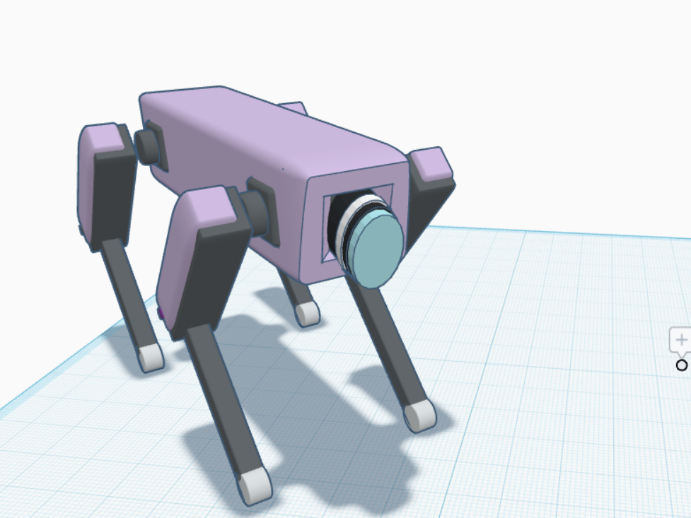

# security-robot-dog

## Project Overview
The Security Robot Dog is a conceptual 3D model designed using Tinkercad. It represents a robotic dog developed for security and surveillance purposes. The model features a simple four-legged structure with a front-mounted camera and built-in Wi-Fi connectivity. The design demonstrates the basic mechanical structure of a security robot while maintaining a simple and lightweight appearance.

## Features
- Four-legged robotic design.
- Front-mounted security camera.
- Built-in Wi-Fi module.
- Servo motors for precise leg movement.
- Lightweight and compact structure.
- Simple mechanical design suitable for educational purposes.

## Main Components
- Robot body
- Four legs
- Leg joints
- Front camera
- Built-in Wi-Fi module
- Servo motors

## Software Used
- Tinkercad

## Project Preview

